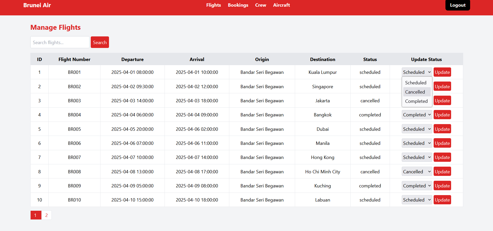
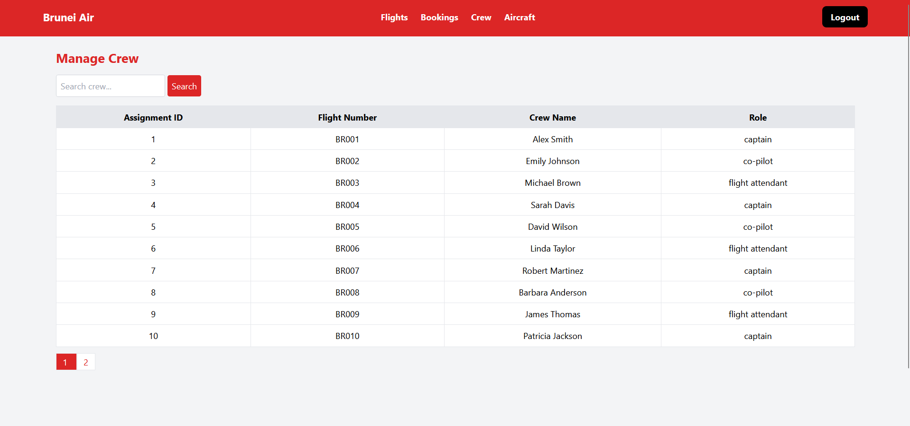

# ✈️ Brunei Airlines Scheduling & Booking System

This project is a **Scheduling and Booking System** for **Brunei Airlines**, designed to manage **flights, bookings, crew assignments, aircraft inventory, and destinations** efficiently. The system supports **admin, staff, and passenger roles**, each with different access levels.

## 📊 Entity-Relationship Diagram (ERD)
Here is the **ERD** for Brunei Airlines:


---

## 🖥️ Admin Dashboard
The admin dashboard provides an overview of system activities.


---

## ✈️ Flights Management
Admins and staff can manage flight schedules.


---

## 🧑‍✈️ Crew Management
Assign crew members to flights and track assignments.


---

## 🛒 Booking System
Passengers can book and manage their flights.


---

## 📌 Features

### 🔹 Admin Panel
- Manage **flights**, **bookings**, **crew**, and **aircraft**.
- Assign **crew members** to flights.
- Update **flight statuses**.
- View **system analytics**.

### 🔹 Staff Dashboard
- Manage **flights** and **crew assignments**.
- Update **aircraft statuses**.

### 🔹 Passenger Portal
- **View available flights**.
- **Book flights** with seat selection.
- **Cancel bookings**.
- **Check booking history**.

---

## 🏢 Tech Stack

- **Frontend**: Tailwind CSS  
- **Backend**: PHP (with sessions)  
- **Database**: PostgreSQL  

---

## 🛠️ Installation

### 1️⃣ Clone the Repository  
```bash
git clone https://github.com/your-username/your-repo.git
cd your-repo
```

### 2️⃣ Set Up the Database  
* Import **`db/schema.sql`** into **PostgreSQL**.
* Update **`config.php`** with your **database credentials**.

### 3️⃣ Start the Server  
Run the following command in the project directory:  
```bash
php -S localhost:8000
```

### 4️⃣ Access the Application  
Open your browser and go to:  
👉 **http://localhost:8000**

---

## 📚 What’s Included?
👉 **Project Overview**  
👉 **Features by Role**  
👉 **Tech Stack**  
👉 **Installation Steps**  
👉 **How to Contribute**  

---

## 💡 Author

**Sir Syazwi**  
_For Database Design & Development, Intake 16_  
**Cosmopolitan College of Commerce & Technology, 2025**  

---
